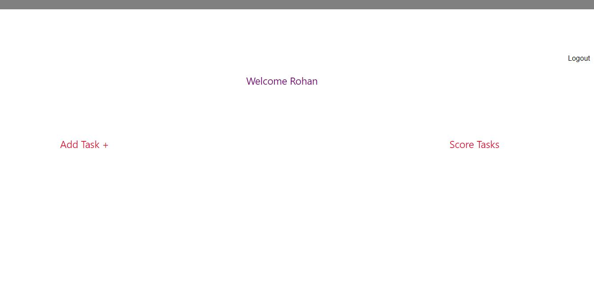

# ImageEditingBootcamp
#  Event Organizer

## Technologies used
* HTML
* CSS
* JS
* Express Js
* React Js
* Node Js

### About
There is an online image editing bootcamp having 3 different tracks- Beginner , Intermediate and Advanced.
A user can register in only one of these tasks.
The instructor will create image editing tasks for students

### Features
* Registration of user and instructor
* Login page for user and instructor
* Creating Task(An instructor will create task for different tracks)
* User will solve task
* Score Task(Instructor will score the tasks solved by users)

### Demo

  
  ## Register
  

   
  
  ## Login
  
  
   
  
  ## Welcome page(for instructor)
  
  
   
  
  .
  ## Add Task
  
   
  
  ## Submit Tasks(for user)
  
  
     ## Welcome page(for instructor)
  
  ## Score Tasks
  
  
   
  
   
  

