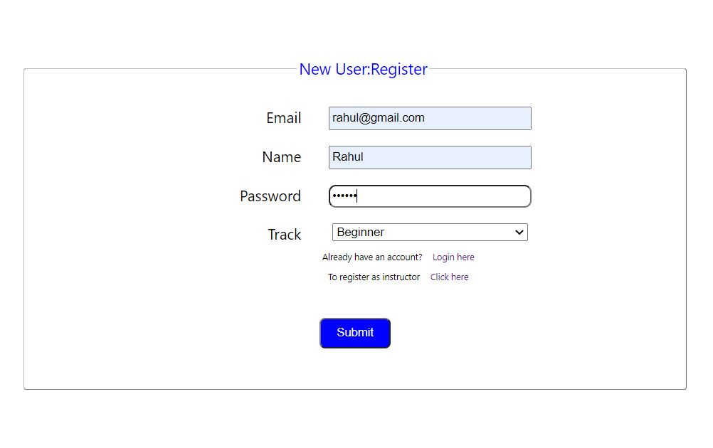
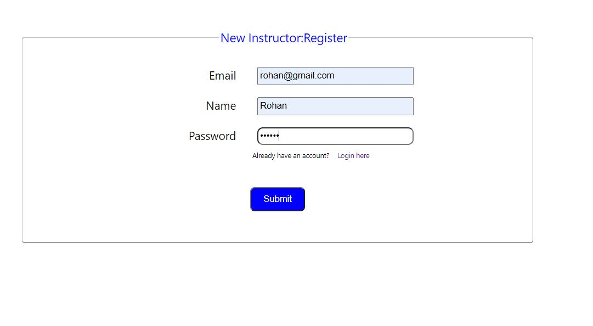
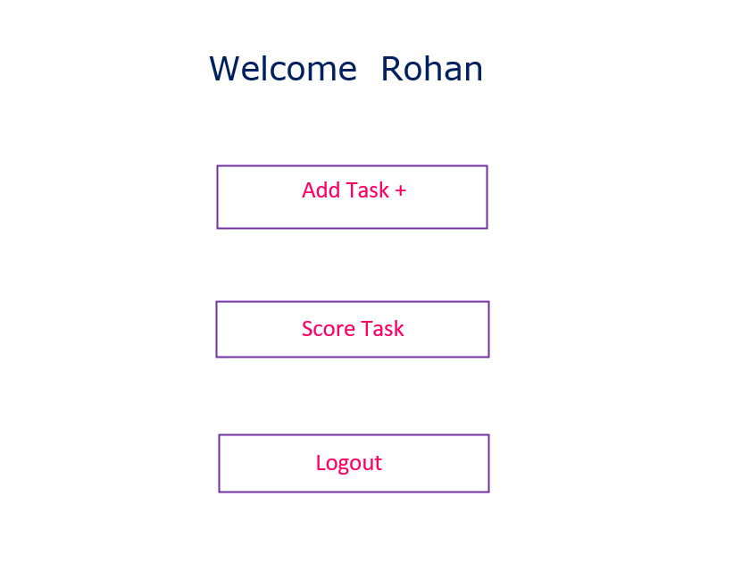
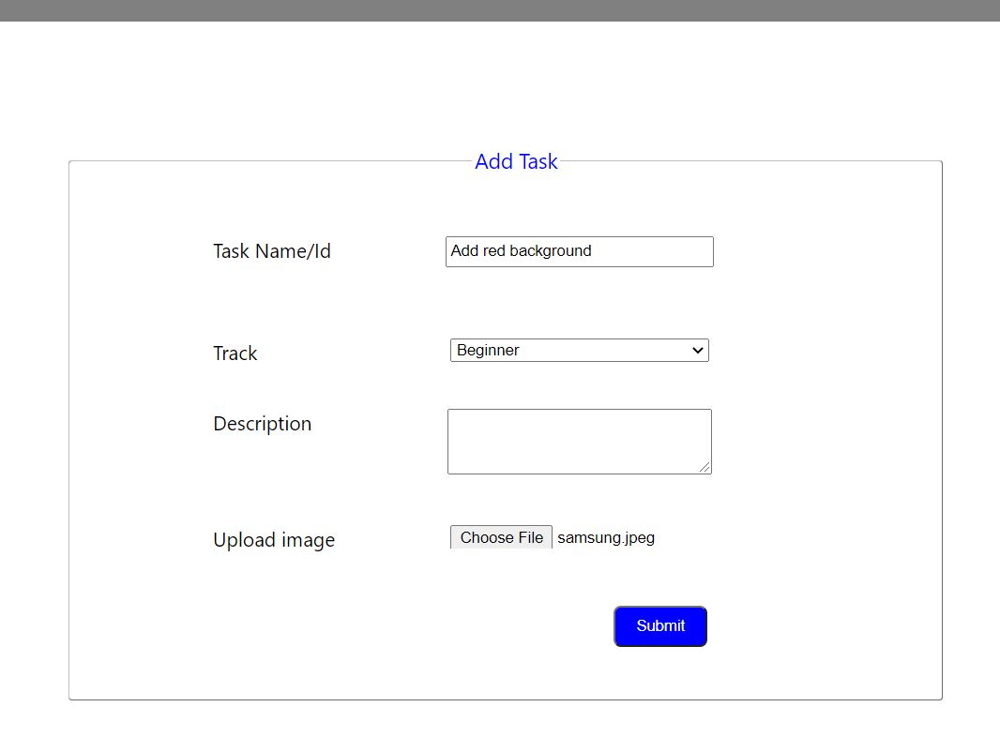
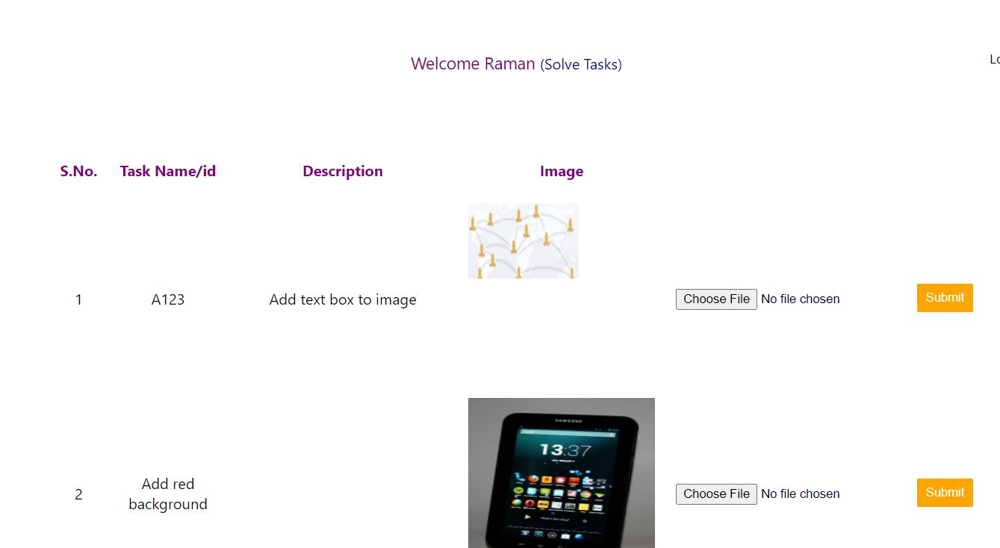
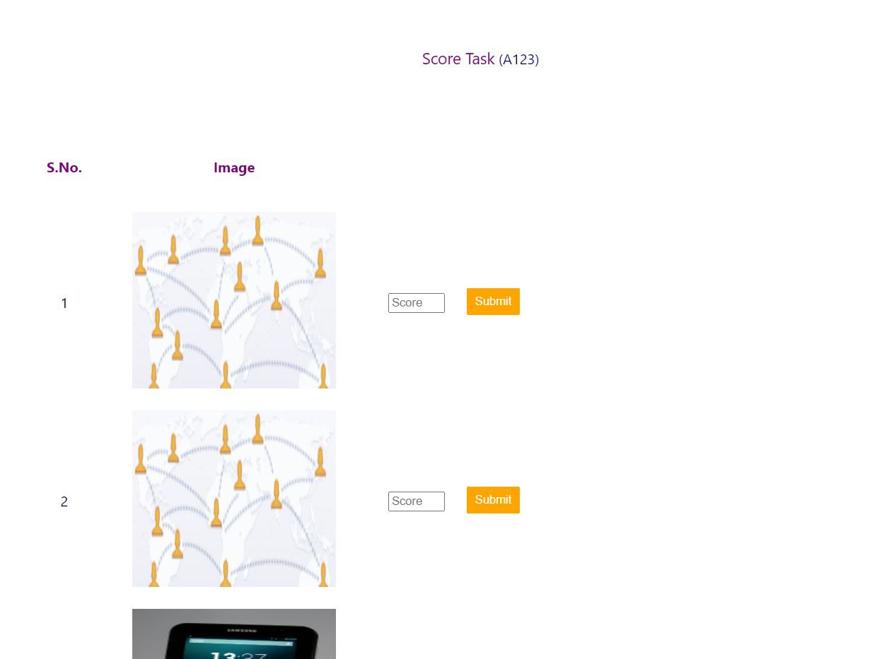
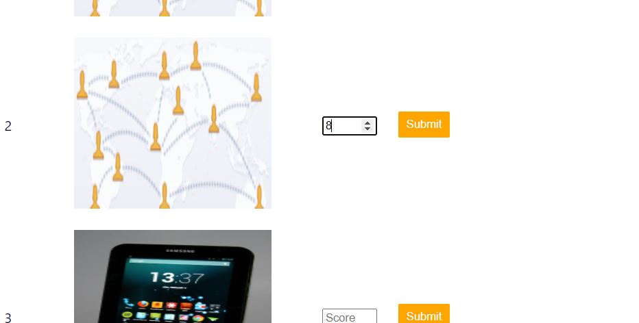

# ImageEditingBootcamp

## Technologies used
* HTML
* CSS
* JS
* Express Js
* React Js
* Node Js

### About
There is an online image editing bootcamp having 3 different tracks- Beginner , Intermediate and Advanced.
 
A user can register in only one of these tasks.
 
The instructor will create image editing tasks for students

### Features
* Registration of user and instructor
* Login page for user and instructor
* Creating Task(An instructor will create task for different tracks)
* User will solve task
* Score Task(Instructor will score the tasks solved by users)

## Demo

  
  #### Register
  

   
  
  #### Login
  
  
   
  
  #### Welcome page(for instructor)
  
  
   
  
  .
  #### Add Task
  
   
  
  #### Submit Tasks(for user)
  
  
    
  
  
  #### Score Tasks
  
  
   
   
  
  
   
  

